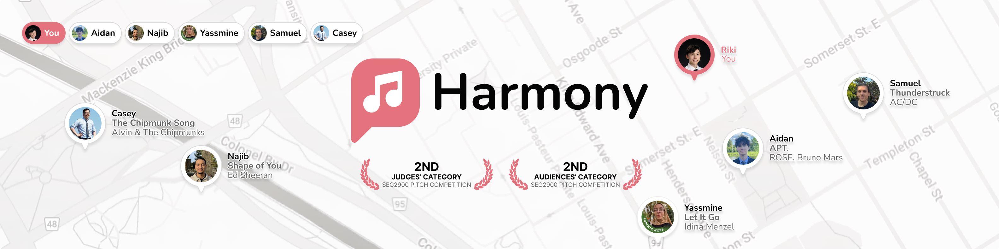

<a href="https://harmaniacz.github.io" target="_blank" align="center">
    </img>
</a>

 

    
    
    
    

# Harmony

A team of five uOttawa students designed and developed this source-controlled, responsive website to market a startup company as part of the SEG 2900 web technologies module.

<a href="https://harmaniacz.github.io/home.html" target="_blank">Open website</a>

## Introduction

**Team name:** Harmaniacz

**Product name:** Harmony

**A brief product description:** Harmony is a social media app which uses music preferences from other apps such as spotify and apple music to connect people based on shared enjoyment of artists, individual songs, and genres.

## Languages and tools

## Website features

- Display responsive web design
- CSS loading animations
- Interactive and accessible web elements
- HTML contact, login, and signup forms
- Error 404 page

## Website links

- [Home](https://harmaniacz.github.io/home)
- [Features](https://harmaniacz.github.io/features)
- [Pricing](https://harmaniacz.github.io/pricing)
- [Team](https://harmaniacz.github.io/team)
- [Download](https://harmaniacz.github.io/download)
- [Contact](https://harmaniacz.github.io/contact)
- [Log in](https://harmaniacz.github.io/login)

## Meet the team

